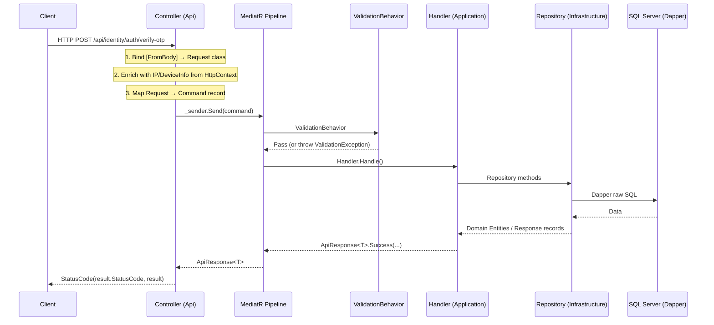

# Detailed Code Samples — Clean Architecture + VSA

> This file contains complete code samples for reference when you need to see a concrete implementation. See `SKILL.md` for the folder structure, naming conventions, and common mistakes checklist.

## 1. Complete Command Slice: VerifyOtp (5 files)

### File 1: Command (immutable record)

```csharp
// VerifyOtpCommand.cs
using MediatR;
using System.Text.Json.Serialization;
using BridgeChat.SharedLibraries.Core.Contracts.Responses;

namespace BridgeChat.IdentityService.Application.Features.Authentication.VerifyOtp;

/// <summary>
/// Command to verify an OTP code and proceed with login/registration.
/// </summary>
/// <param name="PhoneNumber">The phone number that received the OTP.</param>
/// <param name="OtpCode">The 6-digit OTP code.</param>
/// <param name="IpAddress">The client's IP address.</param>
/// <param name="DeviceInfo">The client's device info (User-Agent).</param>
public record VerifyOtpCommand(
    string PhoneNumber,
    string OtpCode,
    [property: JsonIgnore] string? IpAddress,
    [property: JsonIgnore] string? DeviceInfo
) : IRequest<ApiResponse<VerifyOtpResponse>>;
```

> **Note:** Place `<param name>` **above** the `record` declaration, not inline — this avoids CS1587.
> Use `[property: JsonIgnore]` for internal fields (IP, DeviceInfo) that shouldn't be serialized to JSON.

### File 2: Request (mutable class for `[FromBody]`)

```csharp
// VerifyOtpRequest.cs
namespace BridgeChat.IdentityService.Application.Features.Authentication.VerifyOtp;

/// <summary>
/// OTP verification payload.
/// </summary>
public class VerifyOtpRequest
{
    public string PhoneNumber { get; set; } = null!;
    public string OtpCode { get; set; } = null!;
}
```

> **Note:** Request must be a `class` (mutable) so ASP.NET model binding works. Do NOT use `record`, do NOT suffix with `Dto`. Lives inside the Feature folder, not inside the Controller.

### File 3: Response (immutable record)

```csharp
// VerifyOtpResponse.cs
using System.Text.Json.Serialization;

namespace BridgeChat.IdentityService.Application.Features.Authentication.VerifyOtp;

/// <summary>
/// Result returned after successfully verifying an OTP.
/// </summary>
/// <param name="AuthUserId">The AuthUser's Id in the Identity Service.</param>
/// <param name="IsNewUser">Flag indicating whether this is a new or existing user.</param>
/// <param name="AccessToken">The JWT access token.</param>
/// <param name="RefreshToken">The refresh token.</param>
public record VerifyOtpResponse(
    Guid AuthUserId,
    bool IsNewUser,
    string AccessToken,
    [property: JsonIgnore] string RefreshToken,
    Guid SessionId
);
```

### File 4: Validator (FluentValidation + Localization)

```csharp
// VerifyOtpValidator.cs
using FluentValidation;
using Microsoft.Extensions.Localization;
using BridgeChat.SharedLibraries.Core.Localization;

namespace BridgeChat.IdentityService.Application.Features.Authentication.VerifyOtp;

/// <summary>
/// Validator for VerifyOtpCommand.
/// </summary>
public class VerifyOtpValidator : AbstractValidator<VerifyOtpCommand>
{
    public VerifyOtpValidator(IStringLocalizer<GlobalResource> localizer)
    {
        RuleFor(x => x.PhoneNumber)
            .NotEmpty().WithMessage(x => localizer["VALIDATION_PHONE_EMPTY"])
            .Matches(@"^(84|0[3|5|7|8|9])+([0-9]{8})\b").WithMessage(x => localizer["VALIDATION_PHONE_FORMAT"]);

        RuleFor(x => x.OtpCode)
            .NotEmpty().WithMessage(x => localizer["VALIDATION_OTP_EMPTY"])
            .Length(6).WithMessage(x => localizer["VALIDATION_OTP_LENGTH"])
            .Matches("^[0-9]+$").WithMessage(x => localizer["VALIDATION_OTP_FORMAT"]);
    }
}
```

> **Note:** The Validator validates the **Command** (NOT the Request class). Message keys come from `IStringLocalizer<GlobalResource>` — never hardcoded strings. Use the lambda form `x => localizer["KEY"]` (deferred evaluation).

### File 5: Handler (Business Logic)

```csharp
// VerifyOtpCommandHandler.cs
public class VerifyOtpCommandHandler : IRequestHandler<VerifyOtpCommand, ApiResponse<VerifyOtpResponse>>
{
    // Dependencies injected via constructor:
    // ICacheService, IAuthRepository, IRoleRepository, IJwtTokenGenerator,
    // JwtSettings (via IOptions), IStringLocalizer, IPublishEndpoint, IConfiguration, IWebHostEnvironment

    public async Task<ApiResponse<VerifyOtpResponse>> Handle(VerifyOtpCommand request, CancellationToken ct)
    {
        // 1. Check the OTP code in Redis
        // 2. Check whether the user exists in the DB (create if not)
        // 3. Remove the OTP from Redis after use
        // 4. Aggregate the permission bitmask
        // 5. Store the PermissionVersion in Redis
        // 6. Generate the JWT & Refresh Token
        // 7. Persist the Refresh Token to the DB (hashed)
        // 8. Record the LoginHistory
        // 9. Publish a Saga event if this is a new user

        return ApiResponse<VerifyOtpResponse>.Success(
            new VerifyOtpResponse(authUserId, isNewUser, accessToken, refreshToken, sessionId),
            _localizer["VERIFY_OTP_SUCCESS"],
            statusCode    // 201 for a new user, 200 for an existing user
        );
    }
}
```

## 2. Complete Query Slice: GetActiveSessions (4 files)

```csharp
// GetActiveSessionsQuery.cs
public record GetActiveSessionsQuery(Guid UserId, string CurrentToken)
    : IRequest<ApiResponse<IEnumerable<GetActiveSessionsResponse>>>;
```

```csharp
// GetActiveSessionsResponse.cs
public record GetActiveSessionsResponse(
    Guid Id,
    string? IpAddress,
    string? DeviceInfo,
    DateTimeOffset CreatedAt,
    DateTimeOffset ExpiresAt,
    bool IsCurrentSession
);
```

```csharp
// GetActiveSessionsValidator.cs
public class GetActiveSessionsValidator : AbstractValidator<GetActiveSessionsQuery>
{
    public GetActiveSessionsValidator(IStringLocalizer<GlobalResource> localizer)
    {
        RuleFor(x => x.UserId).NotEmpty().WithMessage(x => localizer["VALIDATION_USER_ID_EMPTY"]);
    }
}
```

```csharp
// GetActiveSessionsQueryHandler.cs
public class GetActiveSessionsQueryHandler
    : IRequestHandler<GetActiveSessionsQuery, ApiResponse<IEnumerable<GetActiveSessionsResponse>>>
{
    private readonly ISessionRepository _sessionRepository;
    private readonly IStringLocalizer<GlobalResource> _localizer;

    public async Task<ApiResponse<IEnumerable<GetActiveSessionsResponse>>> Handle(
        GetActiveSessionsQuery request, CancellationToken ct)
    {
        var hashedCurrentToken = TokenHasher.HashToken(request.CurrentToken);
        var result = await _sessionRepository.GetActiveSessionsAsync(request.UserId, hashedCurrentToken);
        return ApiResponse<IEnumerable<GetActiveSessionsResponse>>.Success(
            result, _localizer["GET_ACTIVE_SESSIONS_SUCCESS"], 200);
    }
}
```

## 3. Sample Controller: SessionsController

```csharp
// SessionsController.cs
[ApiController]
[Route("api/identity/sessions")]    // Fixed route, do NOT use [controller]
[Authorize]                          // Auth applied at the Controller level
[Produces("application/json")]
public class SessionsController : ControllerBase
{
    private readonly ISender _sender;
    private readonly IStringLocalizer<GlobalResource> _localizer;

    [HttpPost("active")]
    [ProducesResponseType(typeof(ApiResponse<object>), StatusCodes.Status200OK)]
    [ProducesResponseType(typeof(ApiResponse<object>), StatusCodes.Status401Unauthorized)]
    [ProducesResponseType(typeof(ApiResponse<object>), StatusCodes.Status500InternalServerError)]
    public async Task<IActionResult> GetActiveSessions()
    {
        // 1. Get UserId from the JWT claim
        var userIdString = User.FindFirst(ClaimTypes.NameIdentifier)?.Value
                           ?? User.FindFirst("sub")?.Value;

        // 2. Reject if identity can't be found
        if (string.IsNullOrEmpty(userIdString))
            return Unauthorized(ApiResponse<object>.Failure(_localizer["USER_IDENTITY_NOT_FOUND"], 401));

        var userId = Guid.Parse(userIdString);

        // 3. Get the current RefreshToken from the Cookie
        Request.Cookies.TryGetValue("refreshToken", out var currentRefreshToken);

        // 4. Send the Query to the Application layer and normalize the response
        var query = new GetActiveSessionsQuery(userId, currentRefreshToken ?? string.Empty);
        var result = await _sender.Send(query);

        return StatusCode(result.StatusCode, result);
    }
}
```

## 4. Sample Repository (Dapper + Raw SQL)

```csharp
// SessionRepository.cs
public class SessionRepository : ISessionRepository
{
    private readonly IDbConnection _dbConnection;

    public SessionRepository(IDbConnection dbConnection)
    {
        _dbConnection = dbConnection;
    }

    public async Task<IEnumerable<GetActiveSessionsResponse>> GetActiveSessionsAsync(
        Guid userId, string hashedCurrentToken)
    {
        var sql = @"
            SELECT Id, IpAddress, DeviceInfo, CreatedAt, ExpiresAt,
                   CAST(CASE WHEN Token = @HashedCurrentToken THEN 1 ELSE 0 END AS BIT) AS IsCurrentSession
            FROM RefreshTokens
            WHERE UserId = @UserId AND IsRevoked = 0 AND ExpiresAt > SYSUTCDATETIME()
            ORDER BY CreatedAt DESC;
        ";

        return await _dbConnection.QueryAsync<GetActiveSessionsResponse>(
            sql, new { UserId = userId, HashedCurrentToken = hashedCurrentToken });
    }
}
```

## 5. Overall processing flow


